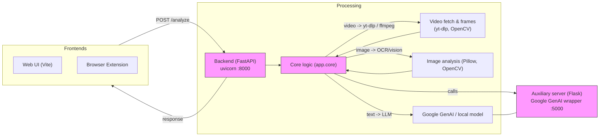

# VerifAI

A small toolkit that detects likely AI-generated content from videos, images and text.

## How to run

These instructions assume you're on Windows (developer environment) and have Python 3.10+ and Node.js installed.

- Create a Python virtual environment and install backend dependencies:

```powershell
python -m venv .venv
.\.venv\Scripts\Activate.ps1   # PowerShell
pip install -r backend/requirements.txt
```

- Start the FastAPI backend (serves the analysis API):

```powershell
# from repository root
cd backend
uvicorn app.main:app --reload --port 8000
```

- Start the auxiliary Flask server (uses Google GenAI integration):

```powershell
cd server
# ensure GEMINI_API_KEY is set in your environment
$env:GEMINI_API_KEY = "<your_key>"
python app.py
# Flask defaults to port 5000 (see server/app.py)
```

- Frontend (web) — run the Vite app(s):

```powershell
cd web
npm install
npm run dev
# default Vite port is 5173

cd ../extension
npm install
npm run dev
```

- Running tests (Python):

```powershell
# from repo root
pip install pytest
pytest -q
```

### Backend

```powershell
cd backend/app

```

## 🏗️ Architecture

A simplified visual of how requests flow through the project (Mermaid):



Notes:
- The FastAPI service exposes `/analyze` which accepts either `url` (video) or `text` (text analysis).
- The `server` app (Flask) wraps calls to the Google GenAI SDK; it expects `GEMINI_API_KEY` in env.

## Important files

- Backend: [backend/app/main.py](backend/app/main.py) — FastAPI entrypoint
- Server: [server/app.py](server/app.py) — Flask/GenAI helper
- Frontend (web): [web/](web)
- Extension UI: [extension/](extension)
- Tests: [tests/](tests)

## Environment variables

- `GEMINI_API_KEY` — required for the Google GenAI integration used by `server/app.py`.

## Developer notes & tips

- The backend chooses analysis type by the incoming JSON: provide `url` to analyze videos or `text` to analyze text (see `backend/app/main.py`).
- Video processing uses `yt-dlp` (see `backend/requirements.txt`) — ensure ffmpeg is installed on your PATH for frame extraction.
- Redis and `fakeredis` are listed in `requirements.txt` for caching/testing; configure a real Redis instance via environment variables if needed.
---