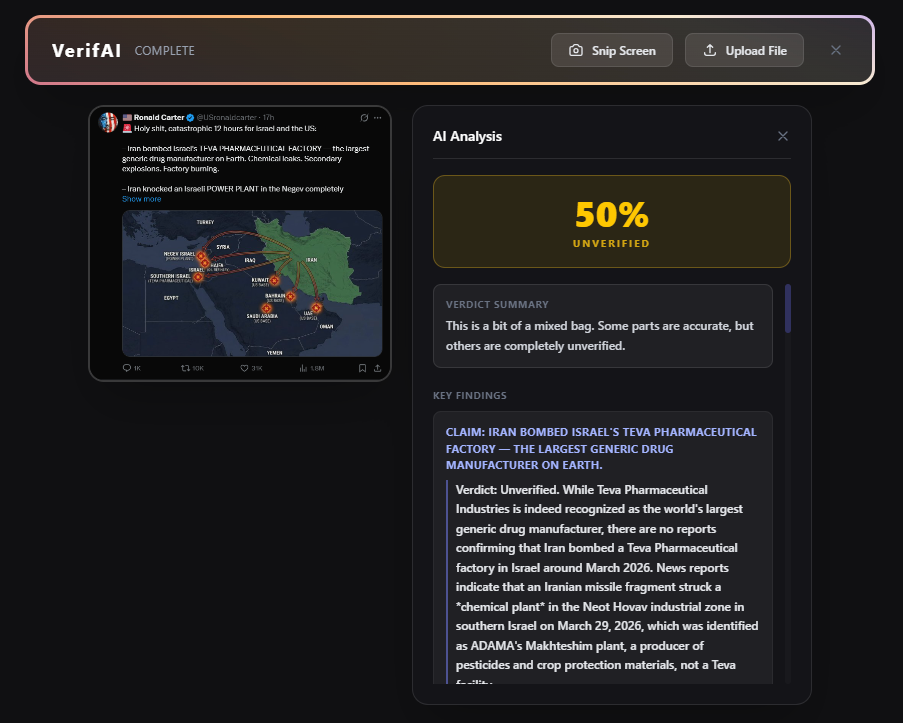
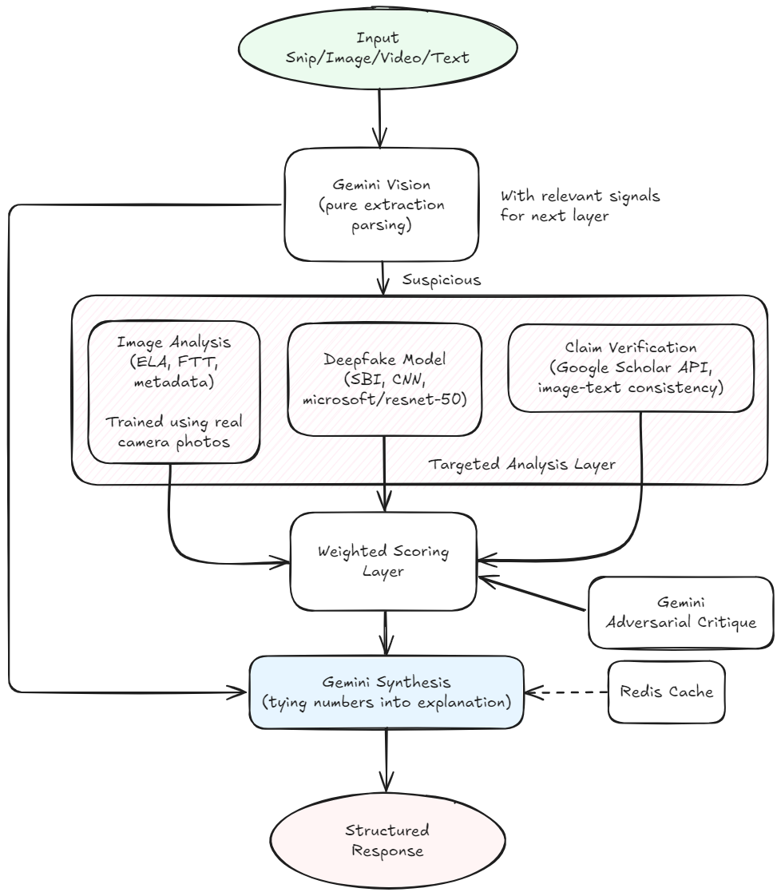

# VerifAI

Submitted to GDG Gemini Hackathon

A multimodal misinformation detection toolkit that analyzes screenshots, images, videos, and text using a multi-stage AI reasoning pipeline.



## Table of Contents
 
- [What it does](#what-it-does)
- [Architecture](#architecture)
  - [Pipeline Example](#pipeline-example)
  - [Signal Gating](#signal-gating)
  - [The Four Gemini Passes](#the-four-gemini-passes)
- [Detection Signals](#detection-signals)
- [Tech Stack](#tech-stack)
- [Project Structure](#project-structure)
- [Getting Started](#getting-started)
- [API](#api)

## What it does

VerifAI goes beyond simply asking an LLM "is this real?" It runs a structured ensemble of forensic signals — computer vision analysis, pretrained deepfake models, fact-checking APIs — and feeds hard numerical evidence into a multi-pass Gemini pipeline that reasons progressively rather than guessing in a single shot.

The result is a credibility score backed by explainable, independently-sourced signals.

## Architecture



### Pipeline Example
 
A tweet screenshot claiming a politician inherited a debt:
 
1. **Pass 1** extracts: `claims: ["inherited $2B deficit", "cut in half in 7 weeks"]`, `faces_detected: true`, `text_overlays: [...]`
2. **Signal layer** runs concurrently: ELA clean, FFT clean, deepfake model → 0.06, fact-check API returns 2 matching reviews
3. **Gate check**: fact-check hit → full pipeline triggered
4. **Pass 2**: face region interrogated — no manipulation artifacts found
5. **Pass 3**: adversarial critique finds the deficit figure is disputed — `confidence_reduction: 0.20`
6. **Pass 4**: synthesizes all evidence → `verdict: uncertain`, `credibility_score: 0.50`, explanation surfaces the disputed claim

### Signal Gating

Not every request runs the full pipeline. The ML signal layer acts as a gate:

- **All signals clean** → lightweight synthesis (2 Gemini calls, fast path)
- **Something flagged** → full 4-pass pipeline (region crops, adversarial critique, synthesis)
- **Face detected only** → deepfake pass + synthesis (3 calls)

## The Four Gemini Passes

| Pass | Role | Output |
|------|------|--------|
| **Pass 1** — Extraction | Structured parser; no verdict | Claims, faces, text overlays, anomalies |
| **Pass 2** — Interrogation | Forensic expert on cropped suspicious regions | Per-region manipulation verdict + confidence |
| **Pass 3** — Adversarial Critique | Devil's advocate; argues the opposite verdict | Counterarguments, confidence reduction |
| **Pass 4** — Synthesis | Judge with full evidence dossier | Final verdict, credibility score, explanation |

Pass 3 is what makes confidence scores meaningful: a verdict that collapses under its own critique surfaces as `confidence: low`. A verdict that survives adversarial pressure earns `confidence: high`.


## Detection Signals

### Image Forensics
- **ELA (Error Level Analysis)** — saves at known JPEG quality, amplifies recompression differences. Tampered regions light up distinctly.
- **FFT Frequency Analysis** — GAN-generated images show periodic grid artifacts from upsampling layers that real camera photos don't.
- **Metadata inspection** — EXIF data cross-referenced against claimed source/context.

### Deepfake Detection
- Pretrained CNN fine-tuned on **FaceForensics++** (Xception architecture)
- `dima806/deepfake_vs_real_image_detection` via HuggingFace Transformers
- Gated on `faces_detected` from Pass 1 — only runs when a face is present
- For video: applied to sampled frames via OpenCV extraction pipeline

### Claim Verification
- **Google Fact Check Tools API** — searches 100+ publisher database against extracted claims
- **CLIP image-text consistency** — detects the most common misinfo pattern: real image, fabricated caption

## Tech Stack

| Layer | Technology |
|-------|------------|
| Primary API | FastAPI (Python) |
| LLM integration | Flask auxiliary server → Google GenAI (Gemini) |
| Computer Vision | OpenCV, Pillow |
| ML Models | HuggingFace Transformers (CLIP, deepfake CNN) |
| Video pipeline | yt-dlp (retrieval) + OpenCV (frame extraction) |
| Caching | Redis (production) / fakeredis (testing) |
| Frontend | Vite + TypeScript |
| Browser Extension | TypeScript |

## Project Structure

```
VerifAI/
├── backend/                  # FastAPI — media routing, analysis orchestration
│   └── app/
│       ├── main.py           # API entrypoint (/analyze)
│       ├── core/analyzer.py  # Multi-pass pipeline orchestration
│       └── analysis/         # ELA, FFT, deepfake, CLIP, factcheck modules
├── server/                   # Flask — Google GenAI (Gemini) wrapper
│   └── app.py
├── web/                      # Vite frontend (TypeScript) (depreciated)
├── extension/                # Browser extension (TypeScript) (depreciated)
└── client/                   # Electron desktop overlay
```

## Getting Started

**Prerequisites:** Python 3.10+, Node.js, ffmpeg on PATH, Redis (optional for caching)

**Environment Variables**
| Variable | Required | Description |
|----------|----------|-------------|
| `GEMINI_API_KEY` | Yes | Google GenAI API key for Gemini Vision |
| `GOOGLE_FACTCHECK_API_KEY` | Optional | Enables Google Fact Check Tools API |
| `REDIS_URL` | Optional | Redis instance for response caching |

1. Python environment

	```bash
	python -m venv .venv
	.\.venv\Scripts\Activate.ps1   # PowerShell
	# source .venv/bin/activate    # bash/zsh
	pip install -r backend/requirements.txt
	```

2. Start the backend (locally)

	```bash
	cd server
	export GEMINI_API_KEY="<your_key>"   # or $env:GEMINI_API_KEY on PowerShell
	python app.py
	```

4. Start the frontend

	```bash
	# Desktop client
	cd client && npm install && npm run dev
	```

## API

**`POST /analyze`**

```json
{
  "url": "https://...",        // video URL (yt-dlp compatible)
  "image": "<base64>",         // image bytes
  "text": "claim to verify",   // text-only analysis
  "caption": "optional caption for image-text consistency check"
}
```

**Response**

```json
{
  "final_verdict": "likely_authentic | likely_manipulated | uncertain",
  "credibility_score": 0.82,
  "confidence": "high | medium | low",
  "explanation": "Plain-English summary for non-experts.",
  "signals": {
    "ela": { "mean_error": 8.4, "suspicious": false },
    "fft": { "peak_ratio": 18.2, "suspicious": false },
    "deepfake_model": { "fake_probability": 0.06, "suspicious": false },
    "factcheck": { "found": true, "ratings": [...] }
  },
  "passes": {
    "extraction": { "claims": [...], "faces_detected": true, ... },
    "region_verdicts": [...],
    "critique": { "counterarguments": [...], "verdict_confidence_reduction": 0.05 },
    "synthesis": { ... }
  }
}
```